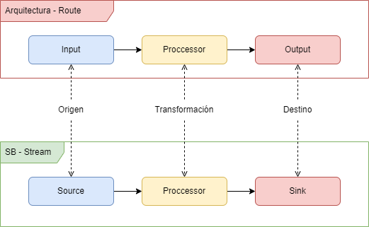

# spring cloud data flow

Proyecto para testear la herramienta.

## Servers

Los servidores de la herramiente estan en la carpeta `servers` para arrancarlos es necesario abrir una terminal y ejecutar el archivo `start-servers.sh` y dejarlo corriendo.

para bajar los servidores usar:

```bash
curl https://repo.maven.apache.org/maven2/org/springframework/cloud/spring-cloud-dataflow-server/2.11.5/spring-cloud-dataflow-server-2.11.5.jar
curl https://repo.maven.apache.org/maven2/org/springframework/cloud/spring-cloud-skipper-server/2.11.5/spring-cloud-skipper-server-2.11.5.jar
```

La interfaz de esta es [http://localhost:9393/dashboard](http://localhost:9393/dashboard)

> notas: aquí hay mas info sobre los servers: [https://dataflow.spring.io/docs/installation/local/manual/](https://dataflow.spring.io/docs/installation/local/manual/)

## Rabbitmq

Es necesario usar este server o kafka ya que el stream de datos necesita alguno de estos dos para pasar los datos entre los componentes, (aunque creo que tambien se puede directo pero en la mayoria de los documentos mencinan uno de estos dos). Para esto esta el scripts `start-rabbitmq` en la carpeta `rabbitmq`, este script va a descargar una imagen con podman y hechara andar un servidor basico de raabitmq con la interfaz de administracion.

La interfaz de esta es [http://localhost:15672](http://localhost:15672)

## Proyectos

La prueba seria con tres componentes:

- file-watcher `source`: se encargaria de revisar una ruta y obtner los json `en progreso`.
- json-to-xml  `processor`: convertir json a xml `pendiente`
- save-xml `sink`: guardar el xml del stream a a una ruta `pendiente`.

## Comparativa de una ruta con el stream


